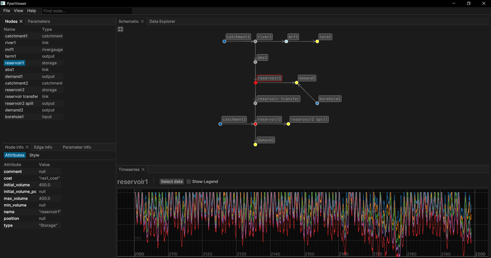

# Pywr viewer desktop releases

Pywr viewer is a desktop application for Windows and Linux for viewing [Pywr](https://github.com/pywr/pywr) models and results.

## Features

- Loading Pywr JSON and visualising the network and view node attributes.
- Visualise parameter relationships.
- Layout the network (moving nodes and force simulation) and import/export coordinates. 
- Searching for specific nodes.
- Custom layout and styles saved in viewer project file.
- Load multiple result datasets (HDF5 or CSV) and view timeseries plots for each node.
- Use data explorer to view and explore multiple plots together.
- Add optional mapping data for working with validation datasets from other models.

## Quick start: 

- File->New and select an existing Pywr model JSON file to create a project.
- Right-click to pan the map and to select nodes or edges. 
- Turn panels on/off in the settings menu and drag to resize/move.
- Add existing CSV coordinates using File->Add coordinates.
- Add TablesRecorder outputs using the dataset manager and view timeseries plots in the node info dialog.
- Search for nodes using the search box in the menu bar.

## License

These binaries are released under the MIT Licence. See the LICENCE file for more information.
